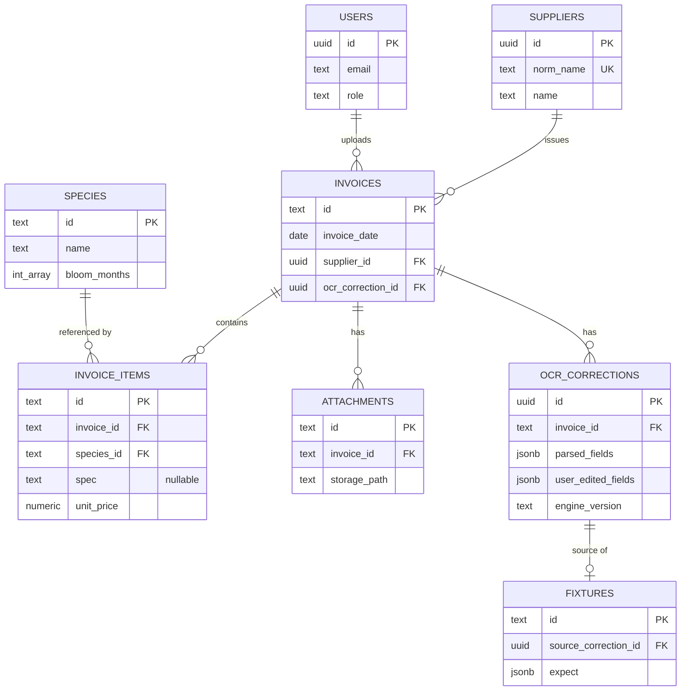

# DATA_MODEL — 무엇을 · 어디에 · 어떤 구조로 저장하는가

> 이 문서는 구현 문서가 아니라 **데이터 모델 설계 문서**다.
> "왜 저장하는가"(VISION.md)가 아니라 **"무엇을 어디에 저장하는가"** 를 정의한다.
> 실제 DB 구조(`species-catalog/supabase/schema.sql`)와 일치해야 한다.
> 현재 Sprint 범위만 구현 상태로, 미래 데이터는 **Planned** 로만 표기한다.
> 기준 문서: VISION.md. (지정된 `DATA_STRATEGY.md` 는 아직 없음 `[확인 필요]`)

## 0. 저장 위치 현황 (정직한 현재 상태)

| 데이터 | 현재 authoritative | Cloud(목표) | 상태 |
|---|---|---|---|
| species · invoices · invoice_items · meta | **LocalStorage v2** | Cloud 테이블 | dual-write 미러 중 · Cloud 는 schema 정의됨 · **대시보드 적용 `[확인 필요]`** |
| 첨부 원본(JPG/PNG/PDF blob) | **IndexedDB** `species-catalog` | Cloud Storage `attachments`(T8) | 로컬만 |
| OCR 학습 데이터 | (수정 이력은 앱 내부) | Cloud `ocr_corrections`(T9 배선) | 스키마만 |
| Fixture | **git** `tests/ocr-corpus/*.json` | Cloud `fixtures` 미러(T9) | git primary |

> Cloud = SoT 는 **목표 상태**다. 7/7 PASS 전까지 LocalStorage 가 실제
> 원본이며, 아래 테이블 정의는 schema.sql 에 확정된 **목표 구조**다.

## 1. 전체 데이터 흐름

```
거래명세서(업로드)
  ↓
attachments        (첨부 메타 · 원본은 Storage)
  ↓
OCR (vision.js)    (Tesseract kor+eng)
  ↓
ocr_corrections    (raw · normalized · parsed ↔ user_edited = 학습 데이터)
  ↓
invoices + invoice_items   (정규화 저장 · supplier_id/species_id 연결)
  ↓
price_history (VIEW)        (invoice_items 기반 실거래 시세)
  ↓
AI Dataset (미래)          (학습 데이터 · Planned)
```

## 2. 현재 구현된(스키마 정의된) 테이블

> 컬럼은 대표만 표기. 전체는 `schema.sql` 참조.

### users
- **목적**: `auth.users` 1:1 미러. 로그인 감사·attribution(누가 올렸나). **개인 소유권 아님.**
- **주요 컬럼**: `id uuid PK→auth.users`, `email`, `display_name`, `role('user'|'admin')`, `last_login_at`.
- **관계**: 여러 테이블의 `created_by`/`uploaded_by` 가 참조.

### suppliers
- **목적**: 거래처 정규화. 표기 차이 중복을 DB 레벨에서 단일화.
- **주요 컬럼**: `id uuid PK`, `name`, `norm_name UNIQUE`(lower+공백제거), `region`, `phone`.
- **관계**: `invoices` (1:N).

### species
- **목적**: 수종 마스터(공용 카탈로그).
- **주요 컬럼**: `id text PK`(sp-### 보존), `name`, `latin`, `category`, `bloom_months int[]`, `colors text[]`, `suppliers jsonb`(임베드 이관 수용), `version`.
- **관계**: `invoice_items` (1:N), `price_history` (파생).

### invoices
- **목적**: 거래명세서 헤더.
- **주요 컬럼**: `id text PK`(inv-### 보존), `invoice_date`, `invoice_number`, `supplier_id→suppliers`, `supplier/supplier_phone/supplier_address`(원문 스냅샷 보존), `ocr_correction_id→ocr_corrections`, `version`, `uploaded_by`.
- **관계**: `suppliers`(N:1), `invoice_items`(1:N), `attachments`(1:N), `ocr_corrections`(1:N).

### invoice_items
- **목적**: 품목 라인. **가격 이력의 유일한 진실(SoT).**
- **주요 컬럼**: `id text PK`(item-### 보존), `invoice_id→invoices`(cascade), `species_id→species`(nullable), `species_name`, `spec`(**NULLABLE · 규격 Optional · 추측 금지**), `unit`, `quantity`, `unit_price`, `amount`.
- **관계**: `invoices`(N:1), `species`(N:1), `price_history`(파생).

### attachments
- **목적**: 첨부 파일 메타. **blob 은 DB 에 넣지 않음** (Storage bucket).
- **주요 컬럼**: `id text PK`, `invoice_id→invoices`(cascade), `filename`, `mime_type`, `size_bytes`, `storage_path`, `thumbnail_path`.
- **관계**: `invoices`(N:1).

### ocr_corrections
- **목적**: **OCR 학습 데이터** (INSERT-ONLY). 수정할 때마다 새 행(version+1) — 수정 이력 자체가 학습 데이터.
- **주요 컬럼**: `id uuid PK`, `invoice_id→invoices`(**on delete set null · 데이터셋 영구 보존**), `version`, `raw_text`, `normalized_text`, `parsed_fields jsonb`, `user_edited_fields jsonb`, `debug_meta jsonb`, `engine_version`(vision.js SHA).
- **관계**: `invoices`(N:1), `fixtures`(1:N via source_correction_id).

### fixtures
- **목적**: OCR 회귀 fixture 의 Cloud 미러 (INSERT-ONLY · **git 이 primary**).
- **주요 컬럼**: `id text PK`('24-parens-...' 형식), `description`, `ocr_text`, `expect jsonb`, `coverage jsonb`, `change_log jsonb`, `source_correction_id→ocr_corrections`, `git_commit_sha`.
- **관계**: `ocr_corrections`(N:1).

### audit_log
- **목적**: 모든 공용 테이블 변경 이력. **트리거가 자동 기록**(앱은 직접 쓰지 않음).
- **주요 컬럼**: `id bigint PK`, `table_name`, `row_id`, `action('INSERT'|'UPDATE'|'DELETE')`, `old_data jsonb`, `new_data jsonb`, `changed_by`, `changed_at`.
- **관계**: 논리적 참조만(FK 없음).

### price_history  *(VIEW · 실테이블 아님)*
- **목적**: 실거래 기반 수종별 시세. 진실은 `invoice_items` 한 곳(이중 쓰기 차단).
- **구성**: `invoice_items ⋈ invoices` (species_id not null). 컬럼: species·supplier·spec·unit·quantity·unit_price·amount·invoice_date.
- **비고**: 10만 행+ 에서 MATERIALIZED VIEW 전환 가능(이름 동일 → 클라이언트 무수정). 임계 규모 `[확인 필요]`.

## 3. AI 학습 데이터 흐름

```
거래명세서
  ↓
OCR 원본           raw_text            (ocr_corrections.raw_text)
  ↓
정규화             normalized_text     (ocr_corrections.normalized_text)
  ↓
파서 결과          parsed_fields       (ocr_corrections.parsed_fields)
  ↓
사용자 수정        user_edited_fields  (ocr_corrections.user_edited_fields)
  ↓
최종 데이터        invoices + invoice_items
  ↓
AI 학습 데이터     parsed ↔ edited 쌍 + engine_version → 다음 OCR 개선 근거
```

> 핵심: **`parsed_fields ↔ user_edited_fields` 쌍**이 "AI 가 어디서 틀렸나"의
> 정답 데이터다. `engine_version` 으로 엔진 버전별 정확도 추이를 산출한다.

## 4. Planned Data Model (Sprint 밖 · **구현하지 않음**)

> 향후 "대한민국 최고의 조경 AI 플랫폼" 으로 확장 시 저장될 데이터.
> **지금 구현하지 않는다.** 방향만 표기(세부는 IDEAS.md).

| 테이블(Planned) | 용도 | 상태 |
|---|---|---|
| `projects` | 조경 프로젝트(현장) 단위 | Planned |
| `quotations` | 견적서 | Planned |
| `purchase_orders` | 발주서 | Planned |
| `farms` | 농장/공급원 네트워크 | Planned |
| `planting_history` | 식재 이력 | Planned |
| `maintenance` | 유지관리 이력 | Planned |
| `schedules` | 일정 | Planned |
| `photos` | 현장 사진 | Planned |
| `supplier_aliases` | 거래처 별칭→정본(데이터 무결성) | Planned (IDEAS.md) |
| `ocr_corrections.field_confidence` | 필드 단위 confidence | Planned (IDEAS.md) |

## 5. 데이터 관계도 (Mermaid ER)



> 파생/부가:
> - **price_history** = `INVOICE_ITEMS ⋈ INVOICES` VIEW (엔터티 아님).
> - **audit_log** = 모든 공용 테이블의 변경 이력(트리거 자동 · FK 없음).
> - `INVOICES.ocr_correction_id → OCR_CORRECTIONS` (대표 correction 역참조).
